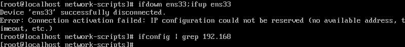
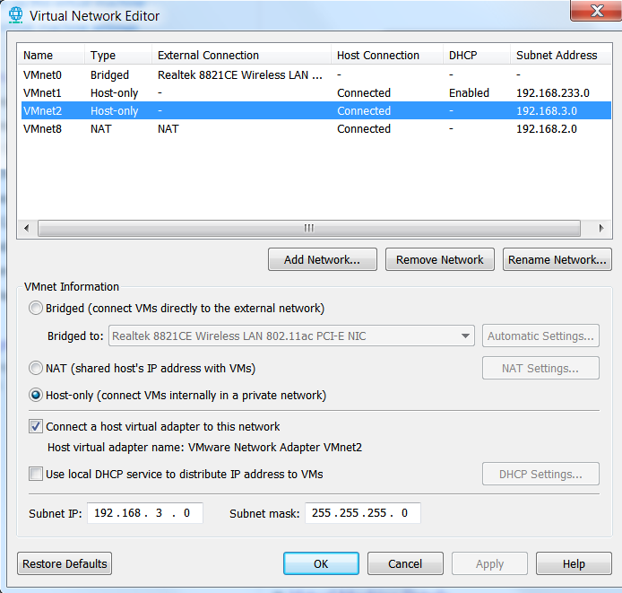

### reference
```text
https://www.bilibili.com/video/BV164411J761?p=24
```
### install
```shell script
[root@docker-210 cronsun-v0.3.5]# yum install dhcp
Loaded plugins: fastestmirror
Loading mirror speeds from cached hostfile
epel/x86_64/metalink                                                 | 3.0 kB  00:00:00     
 * base: mirrors.tuna.tsinghua.edu.cn
 * epel: hkg.mirror.rackspace.com
 * extras: mirror.bit.edu.cn
 * updates: mirror.bit.edu.cn
base                                                                 | 3.6 kB  00:00:00     
docker-ce-stable                                                     | 3.5 kB  00:00:00     
epel                                                                 | 4.7 kB  00:00:00     
extras                                                               | 2.9 kB  00:00:00     
updates                                                              | 2.9 kB  00:00:00     
(1/2): epel/x86_64/updateinfo                                                                                                 | 1.0 MB  00:00:07     
(2/2): epel/x86_64/primary_db                                                                                                 | 6.9 MB  00:00:12     
Resolving Dependencies
--> Running transaction check
---> Package dhcp.x86_64 12:4.2.5-82.el7.centos will be installed
--> Processing Dependency: dhcp-libs(x86-64) = 12:4.2.5-82.el7.centos for package: 12:dhcp-4.2.5-82.el7.centos.x86_64
--> Processing Dependency: dhcp-common = 12:4.2.5-82.el7.centos for package: 12:dhcp-4.2.5-82.el7.centos.x86_64
--> Running transaction check
---> Package dhcp-common.x86_64 12:4.2.5-79.el7.centos will be updated
--> Processing Dependency: dhcp-common = 12:4.2.5-79.el7.centos for package: 12:dhclient-4.2.5-79.el7.centos.x86_64
---> Package dhcp-common.x86_64 12:4.2.5-82.el7.centos will be an update
---> Package dhcp-libs.x86_64 12:4.2.5-79.el7.centos will be updated
---> Package dhcp-libs.x86_64 12:4.2.5-82.el7.centos will be an update
--> Running transaction check
---> Package dhclient.x86_64 12:4.2.5-79.el7.centos will be updated
---> Package dhclient.x86_64 12:4.2.5-82.el7.centos will be an update
--> Finished Dependency Resolution

Dependencies Resolved

=====================================================================================================================================================
 Package                            Arch                          Version                                          Repository                   Size
=====================================================================================================================================================
Installing:
 dhcp                               x86_64                        12:4.2.5-82.el7.centos                           base                        515 k
Updating for dependencies:
 dhclient                           x86_64                        12:4.2.5-82.el7.centos                           base                        286 k
 dhcp-common                        x86_64                        12:4.2.5-82.el7.centos                           base                        176 k
 dhcp-libs                          x86_64                        12:4.2.5-82.el7.centos                           base                        133 k

Transaction Summary
=====================================================================================================================================================
Install  1 Package
Upgrade             ( 3 Dependent packages)

Total download size: 1.1 M
Is this ok [y/d/N]: y
Downloading packages:
Delta RPMs disabled because /usr/bin/applydeltarpm not installed.
(1/4): dhclient-4.2.5-82.el7.centos.x86_64.rpm                                                                                | 286 kB  00:00:06     
(2/4): dhcp-4.2.5-82.el7.centos.x86_64.rpm                                                                                    | 515 kB  00:00:06     
(3/4): dhcp-common-4.2.5-82.el7.centos.x86_64.rpm                                                                             | 176 kB  00:00:06     
(4/4): dhcp-libs-4.2.5-82.el7.centos.x86_64.rpm                                                                               | 133 kB  00:00:06     
-----------------------------------------------------------------------------------------------------------------------------------------------------
Total                                                                                                                165 kB/s | 1.1 MB  00:00:06     
Running transaction check
Running transaction test
Transaction test succeeded
Running transaction
  Updating   : 12:dhcp-libs-4.2.5-82.el7.centos.x86_64                                                                                           1/7 
  Updating   : 12:dhcp-common-4.2.5-82.el7.centos.x86_64                                                                                         2/7 
  Updating   : 12:dhclient-4.2.5-82.el7.centos.x86_64                                                                                            3/7 
  Installing : 12:dhcp-4.2.5-82.el7.centos.x86_64                                                                                                4/7 
  Cleanup    : 12:dhclient-4.2.5-79.el7.centos.x86_64                                                                                            5/7 
  Cleanup    : 12:dhcp-common-4.2.5-79.el7.centos.x86_64                                                                                         6/7 
  Cleanup    : 12:dhcp-libs-4.2.5-79.el7.centos.x86_64                                                                                           7/7 
  Verifying  : 12:dhcp-common-4.2.5-82.el7.centos.x86_64                                                                                         1/7 
  Verifying  : 12:dhclient-4.2.5-82.el7.centos.x86_64                                                                                            2/7 
  Verifying  : 12:dhcp-libs-4.2.5-82.el7.centos.x86_64                                                                                           3/7 
  Verifying  : 12:dhcp-4.2.5-82.el7.centos.x86_64                                                                                                4/7 
  Verifying  : 12:dhcp-libs-4.2.5-79.el7.centos.x86_64                                                                                           5/7 
  Verifying  : 12:dhclient-4.2.5-79.el7.centos.x86_64                                                                                            6/7 
  Verifying  : 12:dhcp-common-4.2.5-79.el7.centos.x86_64                                                                                         7/7 

Installed:
  dhcp.x86_64 12:4.2.5-82.el7.centos                                                                                                                 

Dependency Updated:
  dhclient.x86_64 12:4.2.5-82.el7.centos          dhcp-common.x86_64 12:4.2.5-82.el7.centos          dhcp-libs.x86_64 12:4.2.5-82.el7.centos         

Complete!

[root@docker-210 cronsun-v0.3.5]# yum list installed | grep dhcp
dhcp.x86_64                          12:4.2.5-82.el7.centos         @base       
dhcp-common.x86_64                   12:4.2.5-82.el7.centos         @base       
dhcp-libs.x86_64                     12:4.2.5-82.el7.centos         @base   
```

## practice
### practice 1, DHCP client get ip from DHCP server

#### DHCP server configure
```text
# *.example is template file
[root@docker-210 cronsun-v0.3.5]# cat /etc/dhcp/dhcpd.conf 
#
# DHCP Server Configuration file.
#   see /usr/share/doc/dhcp*/dhcpd.conf.example
#   see dhcpd.conf(5) man page
#


[root@docker-210 dhcp-common-4.2.5]# ls /usr/share/doc/ | grep dhcp*
dhclient-4.2.5
dhcp-4.2.5
dhcp-common-4.2.5
[root@docker-210 dhcp-common-4.2.5]# cd /usr/share/doc/dhcp-4.2.5
[root@docker-210 dhcp-4.2.5]# ls
dhcpd6.conf.example  dhcpd.conf.example  ldap


[root@docker-210 ~]# cd /etc/dhcp/
[root@docker-210 dhcp]# ls
dhclient.d  dhclient-exit-hooks.d  dhcpd6.conf  dhcpd.conf  scripts
[root@docker-210 dhcp]# cp dhcpd.conf dhcpd.conf.bak


# copy
[root@docker-210 ~]# cp /usr/share/doc/dhcp-4.2.5/dhcpd.conf.example /etc/dhcp/dhcpd.conf 
[root@docker-210 ~]# cd /etc/dhcp/
[root@docker-210 dhcp]# ls
dhclient.d  dhclient-exit-hooks.d  dhcpd6.conf  dhcpd.conf  dhcpd.conf.bak  scripts

# at least once, has a subnet is the current host subnet
[root@docker-210 dhcp]# vi dhcpd.conf 
subnet 192.168.2.0 netmask 255.255.255.0 {
  range 192.168.2.3 192.168.2.254;              # ip address pool
#  option domain-name-servers 114.114.114.114;   # DNS server ip address
#  option domain-name "internal.example.org";    # dns domain
#  option routers 192.168.2.2;                   # gateway address
#  option broadcast-address 192.168.2.255;       # can not set
  default-lease-time 600;
  max-lease-time 7200;
}


# required
subnet 192.168.2.0 netmask 255.255.255.0 {
  range 192.168.2.3 192.168.2.254;              # ip address pool
  default-lease-time 600;
  max-lease-time 7200;
}


[root@docker-210 dhcp]# systemctl status dhcpd
● dhcpd.service - DHCPv4 Server Daemon
   Loaded: loaded (/usr/lib/systemd/system/dhcpd.service; disabled; vendor preset: disabled)
   Active: inactive (dead)
     Docs: man:dhcpd(8)
           man:dhcpd.conf(5)
[root@docker-210 dhcp]# systemctl start dhcpd
[root@docker-210 dhcp]# systemctl status dhcpd
● dhcpd.service - DHCPv4 Server Daemon
   Loaded: loaded (/usr/lib/systemd/system/dhcpd.service; disabled; vendor preset: disabled)
   Active: active (running) since Fri 2020-11-27 15:00:47 CST; 3s ago
     Docs: man:dhcpd(8)
           man:dhcpd.conf(5)
 Main PID: 5260 (dhcpd)
   Status: "Dispatching packets..."
    Tasks: 1
   Memory: 7.7M
   CGroup: /system.slice/dhcpd.service
           └─5260 /usr/sbin/dhcpd -f -cf /etc/dhcp/dhcpd.conf -user dhcpd -group dhcpd --...

Nov 27 15:00:47 docker-210 dhcpd[5260]: No subnet declaration for br-2afea5a0b14b (172...1).
Nov 27 15:00:47 docker-210 dhcpd[5260]: ** Ignoring requests on br-2afea5a0b14b.  If t...hat
Nov 27 15:00:47 docker-210 dhcpd[5260]:    you want, please write a subnet declaration
Nov 27 15:00:47 docker-210 dhcpd[5260]:    in your dhcpd.conf file for the network segment
Nov 27 15:00:47 docker-210 dhcpd[5260]:    to which interface br-2afea5a0b14b is attac... **
Nov 27 15:00:47 docker-210 dhcpd[5260]: 
Nov 27 15:00:47 docker-210 dhcpd[5260]: Listening on LPF/ens33/00:0c:29:44:72:a0/192.1.../24
Nov 27 15:00:47 docker-210 dhcpd[5260]: Sending on   LPF/ens33/00:0c:29:44:72:a0/192.1.../24
Nov 27 15:00:47 docker-210 dhcpd[5260]: Sending on   Socket/fallback/fallback-net
Nov 27 15:00:47 docker-210 systemd[1]: Started DHCPv4 Server Daemon.
Hint: Some lines were ellipsized, use -l to show in full.


# check      
[root@docker-210 dhcp]# netstat -lnptu
Active Internet connections (only servers)
Proto Recv-Q Send-Q Local Address           Foreign Address         State       PID/Program name    
tcp        0      0 127.0.0.1:25            0.0.0.0:*               LISTEN      1165/master         
tcp        0      0 0.0.0.0:22              0.0.0.0:*               LISTEN      4319/sshd           
tcp6       0      0 ::1:25                  :::*                    LISTEN      1165/master         
tcp6       0      0 :::22                   :::*                    LISTEN      4319/sshd           
udp        0      0 0.0.0.0:67              0.0.0.0:*                           5260/dhcpd          
udp        0      0 127.0.0.1:323           0.0.0.0:*                           667/chronyd         
udp6       0      0 ::1:323                 :::*                                667/chronyd  

```

#### HDCP client
```shell script
[root@localhost ~]# cat /etc/sysconfig/network-scripts/ifcfg-ens33 
TYPE=Ethernet
PROXY_METHOD=none
BROWSER_ONLY=no
BOOTPROTO=dhcp            
DEFROUTE=yes
IPV4_FAILURE_FATAL=no
#IPV6INIT=yes
#IPV6_AUTOCONF=yes
#IPV6_DEFROUTE=yes
#IPV6_FAILURE_FATAL=no
#IPV6_ADDR_GEN_MODE=stable-privacy
NAME=ens33
UUID=f8fc6093-6f9b-4f4c-b3ce-5e0979202906
DEVICE=ens33
ONBOOT=yes

DNS1=192.168.1.1
DNS2=114.114.114.114
DNS3=4.4.4.4
IPV6INIT=no
```

##### vmware
```shell script
# restart ethernet card
# not use, systemctl restart network
[root@localhost ~]# ifdown ens33;ifup ens33
```
##### xshell
```shell script
[root@localhost ~]# ip addr | grep 192.168
    inet 192.168.2.3/24 brd 192.168.2.255 scope global noprefixroute dynamic ens33
```

#### check DHCP server
```shell script
[root@docker-210 dhcp]# systemctl status dhcpd
● dhcpd.service - DHCPv4 Server Daemon
   Loaded: loaded (/usr/lib/systemd/system/dhcpd.service; disabled; vendor preset: disabled)
   Active: active (running) since Fri 2020-11-27 15:00:47 CST; 38min ago
     Docs: man:dhcpd(8)
           man:dhcpd.conf(5)
 Main PID: 5260 (dhcpd)
   Status: "Dispatching packets..."
    Tasks: 1
   Memory: 7.8M
   CGroup: /system.slice/dhcpd.service
           └─5260 /usr/sbin/dhcpd -f -cf /etc/dhcp/dhcpd.conf -user dhcpd -group dhcpd --no-pid

Nov 27 15:35:28 docker-210 dhcpd[5260]: DHCPREQUEST for 192.168.2.3 from 00:0c:29:34:0c:7e via ens33:0
Nov 27 15:35:33 docker-210 dhcpd[5260]: ns1.example.org: host unknown.
Nov 27 15:35:38 docker-210 dhcpd[5260]: ns2.example.org: host unknown.
Nov 27 15:35:38 docker-210 dhcpd[5260]: DHCPACK on 192.168.2.3 to 00:0c:29:34:0c:7e via ens33:0
Nov 27 15:35:38 docker-210 dhcpd[5260]: DHCPREQUEST for 192.168.2.3 from 00:0c:29:34:0c:7e via ens33
Nov 27 15:35:38 docker-210 dhcpd[5260]: DHCPACK on 192.168.2.3 to 00:0c:29:34:0c:7e via ens33
Nov 27 15:35:38 docker-210 dhcpd[5260]: DHCPREQUEST for 192.168.2.3 from 00:0c:29:34:0c:7e via ens33:0
Nov 27 15:35:38 docker-210 dhcpd[5260]: DHCPACK on 192.168.2.3 to 00:0c:29:34:0c:7e via ens33:0
Nov 27 15:35:38 docker-210 dhcpd[5260]: DHCPREQUEST for 192.168.2.3 from 00:0c:29:34:0c:7e via ens33
Nov 27 15:35:38 docker-210 dhcpd[5260]: DHCPACK on 192.168.2.3 to 00:0c:29:34:0c:7e via ens33
```

```shell script
[root@python-110 dhcp]# systemctl list-unit-files | grep dhcpd
dhcpd.service                                 disabled
dhcpd6.service                                disabled
[root@python-110 dhcp]# systemctl enable dhcpd
Created symlink from /etc/systemd/system/multi-user.target.wants/dhcpd.service to /usr/lib/systemd/system/dhcpd.service.
[root@python-110 dhcp]# systemctl list-unit-files | grep dhcpd
dhcpd.service                                 enabled 
dhcpd6.service                                disabled
```

#### stop DHCP server
##### stop DHCP server
```shell script
[root@docker-210 dhcp]# systemctl stop dhcpd
[root@docker-210 dhcp]# systemctl status dhcpd
● dhcpd.service - DHCPv4 Server Daemon
   Loaded: loaded (/usr/lib/systemd/system/dhcpd.service; disabled; vendor preset: disabled)
   Active: inactive (dead)
     Docs: man:dhcpd(8)
           man:dhcpd.conf(5)

Nov 27 15:40:28 docker-210 dhcpd[5260]: ns2.example.org: host unknown.
Nov 27 15:40:28 docker-210 dhcpd[5260]: DHCPACK on 192.168.2.3 to 00:0c:29:34:0c:7e via ens33:0
Nov 27 15:40:28 docker-210 dhcpd[5260]: DHCPREQUEST for 192.168.2.3 from 00:0c:29:34:0c:7e via ens33
Nov 27 15:40:28 docker-210 dhcpd[5260]: DHCPACK on 192.168.2.3 to 00:0c:29:34:0c:7e via ens33
Nov 27 15:40:28 docker-210 dhcpd[5260]: DHCPREQUEST for 192.168.2.3 from 00:0c:29:34:0c:7e via ens33:0
Nov 27 15:40:28 docker-210 dhcpd[5260]: DHCPACK on 192.168.2.3 to 00:0c:29:34:0c:7e via ens33:0
Nov 27 15:40:28 docker-210 dhcpd[5260]: DHCPREQUEST for 192.168.2.3 from 00:0c:29:34:0c:7e via ens33
Nov 27 15:40:28 docker-210 dhcpd[5260]: DHCPACK on 192.168.2.3 to 00:0c:29:34:0c:7e via ens33
Nov 27 15:41:13 docker-210 systemd[1]: Stopping DHCPv4 Server Daemon...
Nov 27 15:41:13 docker-210 systemd[1]: Stopped DHCPv4 Server Daemon.
```
##### vmware restart ethernet card
```shell script
# restart ethernet card
# not use, systemctl restart network
[root@localhost ~]# ifdown ens33;ifup ens33
```


##### get ip automatically
```text
# DHCP server start
[root@docker-210 dhcp]# systemctl start dhcpd

# waiting a moment, DHCP client will get ip again automatically
[root@localhost ~]# ip addr | grep 192.168
    inet 192.168.2.3/24 brd 192.168.2.255 scope global noprefixroute dynamic ens33

# view DHCP server log
[root@localhost ~]# tail -f /var/log/messages
Nov 27 16:08:02 localhost dhcpd: DHCPACK on 192.168.2.3 to 00:0c:29:34:0c:7e via ens33:0
Nov 27 16:08:02 localhost dhcpd: DHCPREQUEST for 192.168.2.3 from 00:0c:29:34:0c:7e via ens33
Nov 27 16:08:02 localhost dhcpd: DHCPACK on 192.168.2.3 to 00:0c:29:34:0c:7e via ens33
Nov 27 16:08:02 localhost dhcpd: DHCPREQUEST for 192.168.2.3 from 00:0c:29:34:0c:7e via ens33:0
Nov 27 16:08:02 localhost dhcpd: DHCPACK on 192.168.2.3 to 00:0c:29:34:0c:7e via ens33:0
Nov 27 16:08:02 localhost dhcpd: DHCPREQUEST for 192.168.2.3 from 00:0c:29:34:0c:7e via ens33
Nov 27 16:08:02 localhost dhcpd: DHCPACK on 192.168.2.3 to 00:0c:29:34:0c:7e via ens33

```
### practice 2, dhcp client get static ip
#### get dhcp client mac, 00:0c:29:34:0c:7e
```text
[root@localhost ~]# ifconfig
ens33: flags=4163<UP,BROADCAST,RUNNING,MULTICAST>  mtu 1500
        inet 192.168.2.3  netmask 255.255.255.0  broadcast 192.168.2.255
        ether 00:0c:29:34:0c:7e  txqueuelen 1000  (Ethernet)
        RX packets 674217  bytes 312225835 (297.7 MiB)
        RX errors 0  dropped 0  overruns 0  frame 0
        TX packets 955612  bytes 1667475302 (1.5 GiB)
        TX errors 0  dropped 0 overruns 0  carrier 0  collisions 0

```
#### dhcp server
```text
[root@docker-210 dhcp]# vi /etc/dhcp/dhcpd.conf
     53 host fantasia {
     54   hardware ethernet 00:0c:29:34:0c:7e;
     55   fixed-address 192.168.2.30;
     56 }
[root@docker-210 dhcp]# systemctl restart dhcpd
```
#### dhcp client
##### vmware
```shell script
# restart ethernet card
# not use, systemctl restart network
[root@localhost ~]# ifdown ens33;ifup ens33
```

```shell script
[root@localhost ~]# ifconfig | grep 192.168
        inet 192.168.2.30  netmask 255.255.255.0  broadcast 192.168.2.255
```

#### dhcp server 租约四部曲
```shell script
[root@docker-210 dhcp]# tail -30 /var/log/messages
# 1
Nov 27 16:37:49 localhost dhcpd: DHCPDISCOVER from 00:0c:29:34:0c:7e via ens33      
# 2        
Nov 27 16:37:49 localhost dhcpd: DHCPOFFER on 192.168.2.30 to 00:0c:29:34:0c:7e via ens33
Nov 27 16:37:49 localhost dhcpd: Dynamic and static leases present for 192.168.2.30.
Nov 27 16:37:49 localhost dhcpd: Remove host declaration fantasia or remove 192.168.2.30
Nov 27 16:37:49 localhost dhcpd: from the dynamic address pool for 192.168.2.0/24
# 3
Nov 27 16:37:49 localhost dhcpd: DHCPREQUEST for 192.168.2.30 (192.168.2.210) from 00:0c:29:34:0c:7e via ens33
# 4
Nov 27 16:37:49 localhost dhcpd: DHCPACK on 192.168.2.30 to 00:0c:29:34:0c:7e via ens33
```
#### dhcp server 续租
```shell script
# 3
Nov 27 16:47:17 localhost dhcpd: DHCPREQUEST for 192.168.2.30 from 00:0c:29:34:0c:7e via ens33
# 4
Nov 27 16:47:17 localhost dhcpd: DHCPACK on 192.168.2.30 to 00:0c:29:34:0c:7e via ens33
```

### practice 3 shared network
####

#### dhcp server
```shell script
# add ethernet card for dhcp server
# 192.168.2.110 -> VMnet8 (NAT)
# 192.168.3.110 -> VMnet2 (Host-only)
[root@python-110 ~]# ifconfig | grep inet
        inet 192.168.2.110  netmask 255.255.255.0  broadcast 192.168.2.255
        inet 192.168.3.110  netmask 255.255.255.0  broadcast 192.168.3.255
        inet 127.0.0.1  netmask 255.0.0.0
```

```shell script
# delete all [subnet] 
# set [shared-network]
[root@python-110 ~]# vi /etc/dhcp/dhcpd.conf
# practice 2
host docker01 {
  hardware ethernet 00:0c:29:34:0c:7e;
  fixed-address 192.168.3.30;
}

host other01 {
  hardware ethernet 00:0c:29:44:72:a0;
  fixed-address 192.168.2.210;
}

# shared network
# through dhcp server to get ip address and router must be dhcp server ip, each of different subnet can ping successfully 
shared-network 2-3 {
  subnet 192.168.2.0 netmask 255.255.255.0 {
    option routers 192.168.2.110;
    range 192.168.2.3 192.168.2.254;
 }
  subnet 192.168.3.0 netmask 255.255.255.0 {
    option routers 192.168.3.110;
    range 192.168.3.3 192.168.3.254;
  }
}

[root@docker-30 network-scripts]# ping 192.168.2.210
PING 192.168.2.210 (192.168.2.210) 56(84) bytes of data.
64 bytes from 192.168.2.210: icmp_seq=22 ttl=63 time=2.49 ms
64 bytes from 192.168.2.210: icmp_seq=23 ttl=63 time=1.52 ms
64 bytes from 192.168.2.210: icmp_seq=24 ttl=63 time=1.78 ms
^C
--- 192.168.2.210 ping statistics ---
24 packets transmitted, 3 received, 87% packet loss, time 23011ms
rtt min/avg/max/mdev = 1.522/1.933/2.493/0.413 ms


[root@python-110 ~]# systemctl start dhcpd
[root@python-110 ~]# systemctl status dhcpd
```
```shell script
# virtual router
[root@python-110 ~]# vi /etc/sysctl.conf 
[root@python-110 ~]# sysctl -p
net.ipv4.ip_forward = 1
```

##### set default gateway can access internet
```shell script
# shared network
shared-network 2-3 {
  subnet 192.168.2.0 netmask 255.255.255.0 {
    option routers 192.168.2.2; 
    range 192.168.2.3 192.168.2.254;
 }

[root@docker-210 network-scripts]# ping www.baidu.com
PING www.wshifen.com (103.235.46.39) 56(84) bytes of data.
64 bytes from 103.235.46.39 (103.235.46.39): icmp_seq=1 ttl=128 time=50.0 ms
64 bytes from 103.235.46.39 (103.235.46.39): icmp_seq=2 ttl=128 time=53.7 ms
64 bytes from 103.235.46.39 (103.235.46.39): icmp_seq=3 ttl=128 time=48.9 ms

```
#### hdcp client
```shell script
# 192.168.2.210 -> VMnet8 (NAT)
# 192.168.3.30 -> VMnet2 (Host-only)
# BOOTPROTO=dhcp  

[root@docker-210 ~]# systemctl restart network
```

#### check log at dhcp server
```shell script
[root@python-110 ~]# tail -f /var/log/messages
Dec  1 10:31:55 python-110 dhcpd: Sending on   LPF/ens33/00:0c:29:5d:f1:dd/2-3
Dec  1 10:31:55 python-110 dhcpd: Sending on   Socket/fallback/fallback-net
Dec  1 10:31:55 python-110 systemd: Started DHCPv4 Server Daemon.
Dec  1 10:32:13 python-110 dhcpd: DHCPDISCOVER from 00:0c:29:34:0c:7e via ens37
Dec  1 10:32:13 python-110 dhcpd: DHCPOFFER on 192.168.3.30 to 00:0c:29:34:0c:7e via ens37
Dec  1 10:32:13 python-110 dhcpd: Dynamic and static leases present for 192.168.3.30.
Dec  1 10:32:13 python-110 dhcpd: Remove host declaration docker01 or remove 192.168.3.30
Dec  1 10:32:13 python-110 dhcpd: from the dynamic address pool for 2-3
Dec  1 10:32:13 python-110 dhcpd: DHCPREQUEST for 192.168.3.30 (192.168.3.110) from 00:0c:29:34:0c:7e via ens37
Dec  1 10:32:13 python-110 dhcpd: DHCPACK on 192.168.3.30 to 00:0c:29:34:0c:7e via ens37
Dec  1 10:35:16 python-110 dhcpd: DHCPDISCOVER from 00:0c:29:44:72:a0 via ens33:0
Dec  1 10:35:16 python-110 dhcpd: DHCPOFFER on 192.168.2.210 to 00:0c:29:44:72:a0 via ens33:0
Dec  1 10:35:16 python-110 dhcpd: DHCPDISCOVER from 00:0c:29:44:72:a0 via ens33
Dec  1 10:35:16 python-110 dhcpd: DHCPOFFER on 192.168.2.210 to 00:0c:29:44:72:a0 via ens33
Dec  1 10:35:16 python-110 dhcpd: Dynamic and static leases present for 192.168.2.210.
Dec  1 10:35:16 python-110 dhcpd: Remove host declaration other01 or remove 192.168.2.210
Dec  1 10:35:16 python-110 dhcpd: from the dynamic address pool for 2-3
Dec  1 10:35:16 python-110 dhcpd: DHCPREQUEST for 192.168.2.210 (192.168.3.110) from 00:0c:29:44:72:a0 via ens33:0
Dec  1 10:35:16 python-110 dhcpd: DHCPACK on 192.168.2.210 to 00:0c:29:44:72:a0 via ens33:0
Dec  1 10:35:16 python-110 dhcpd: Dynamic and static leases present for 192.168.2.210.
Dec  1 10:35:16 python-110 dhcpd: Remove host declaration other01 or remove 192.168.2.210
Dec  1 10:35:16 python-110 dhcpd: from the dynamic address pool for 2-3
Dec  1 10:35:16 python-110 dhcpd: DHCPREQUEST for 192.168.2.210 (192.168.3.110) from 00:0c:29:44:72:a0 via ens33
Dec  1 10:35:16 python-110 dhcpd: DHCPACK on 192.168.2.210 to 00:0c:29:44:72:a0 via ens33
Dec  1 10:35:27 python-110 chronyd[718]: Selected source 84.16.67.12
```

### dhcp relay (failure)
```shell script
https://access.redhat.com/documentation/en-us/red_hat_enterprise_linux/7/html/networking_guide/dhcp-relay-agent
~]# cp /lib/systemd/system/dhcrelay.service /etc/systemd/system/
~]# vi /etc/systemd/system/dhcrelay.service

# hdcp server
ExecStart=/usr/sbin/dhcrelay -d --no-pid 192.168.2.210

~]# systemctl --system daemon-reload
~]# systemctl restart dhcrelay
```