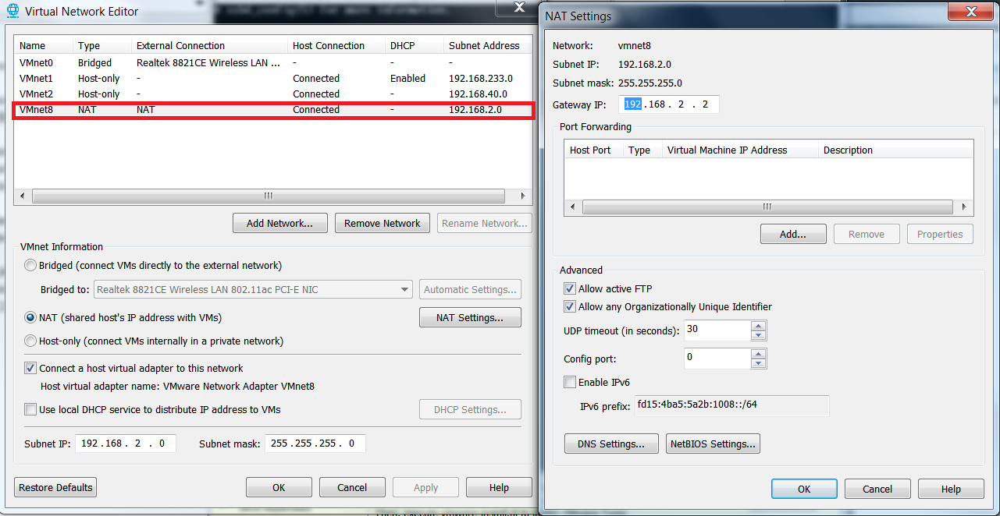
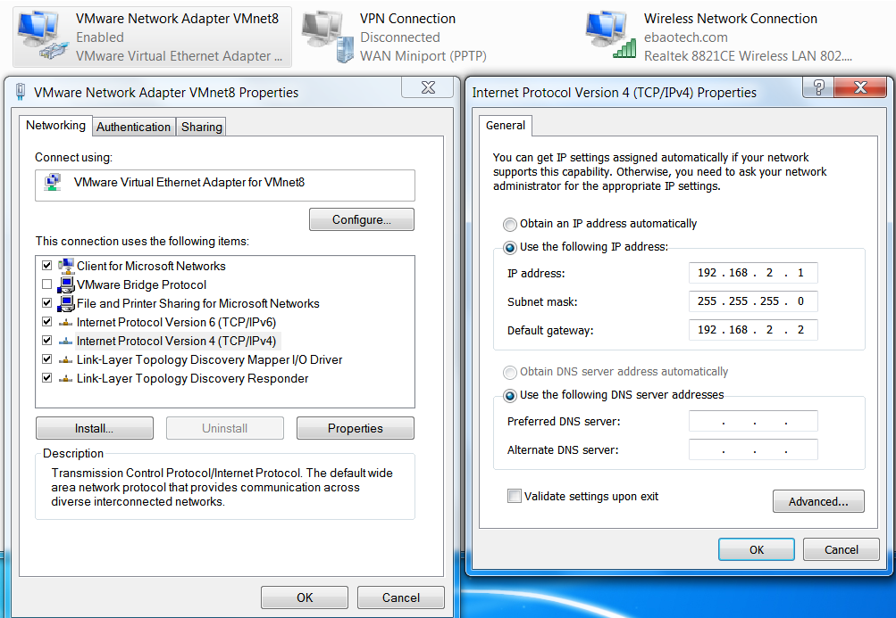
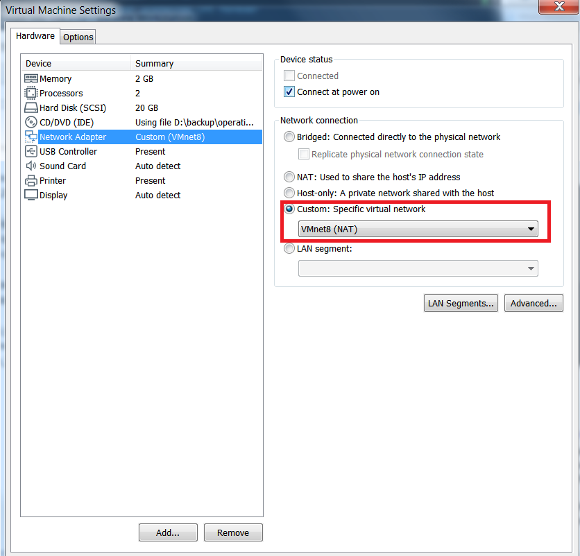
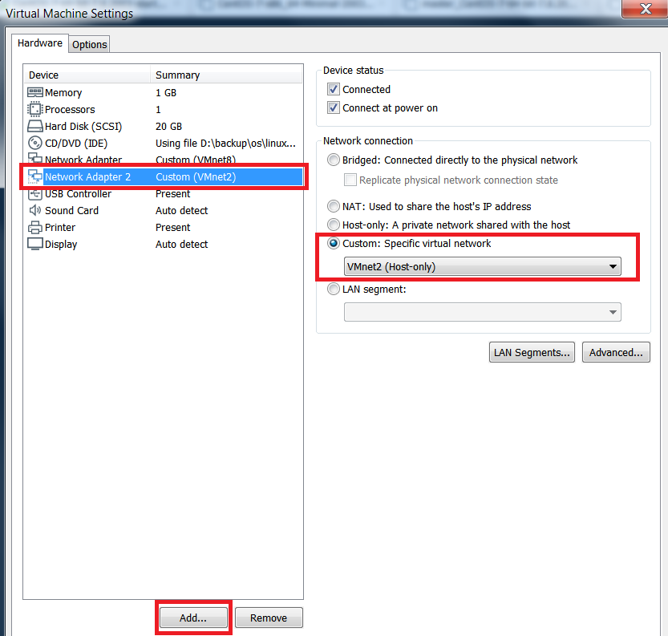
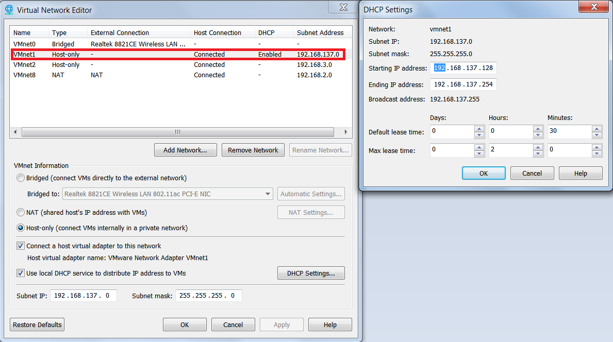
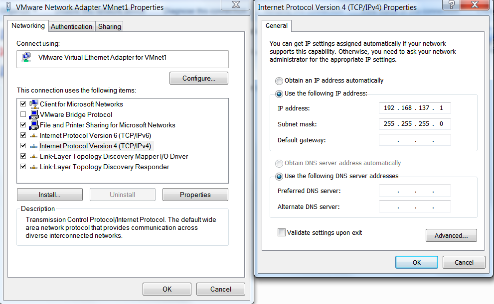
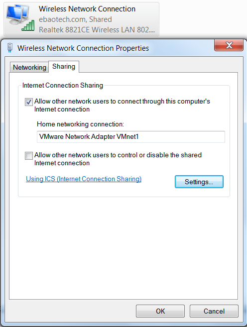
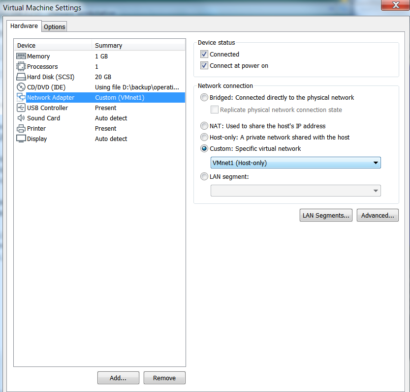

# install CentOS7
## download
    http://mirrors.aliyun.com/centos/7.8.2003/isos/x86_64/
    CentOS-7-x86_64-Minimal-2003.iso
## install at vmware 15

### vmware
    select CentOS-7-x86_64-Minimal-2003.iso
    select default installation
### centos
    set root | root
    
## set network
### vi /etc/sysconfig/network-scripts/ifcfg-ens33
    TYPE=Ethernet
    PROXY_METHOD=none
    BROWSER_ONLY=no
    BOOTPROTO=static
    DEFROUTE=yes
    IPV4_FAILURE_FATAL=no
    #IPV6INIT=yes
    #IPV6_AUTOCONF=yes
    #IPV6_DEFROUTE=yes
    #IPV6_FAILURE_FATAL=no
    #IPV6_ADDR_GEN_MODE=stable-privacy
    NAME=ens33
    UUID=f8fc6093-6f9b-4f4c-b3ce-5e0979202906
    DEVICE=ens33
    ONBOOT=yes
    
    IPADDR=192.168.2.20
    GATEWAY=192.168.2.2
    NETMASK=255.255.255.0
    DNS1=192.168.1.1
    DNS2=114.114.114.114
    DNS3=4.4.4.4
#### systemctl restart network
#### check 
    [root@localhost ~]# ip addr
    1: lo: <LOOPBACK,UP,LOWER_UP> mtu 65536 qdisc noqueue state UNKNOWN group default qlen 1000
        link/loopback 00:00:00:00:00:00 brd 00:00:00:00:00:00
        inet 127.0.0.1/8 scope host lo
           valid_lft forever preferred_lft forever
        inet6 ::1/128 scope host 
           valid_lft forever preferred_lft forever
    2: ens33: <BROADCAST,MULTICAST,UP,LOWER_UP> mtu 1500 qdisc pfifo_fast state UP group default qlen 1000
        link/ether 00:0c:29:dd:a5:66 brd ff:ff:ff:ff:ff:ff
        inet 192.168.2.20/24 brd 192.168.2.255 scope global noprefixroute ens33
           valid_lft forever preferred_lft forever
        inet6 fe80::20c:29ff:fedd:a566/64 scope link 
           valid_lft forever preferred_lft forever
           
    [root@localhost ~]# ping www.baidu.com
    PING www.a.shifen.com (61.135.169.121) 56(84) bytes of data.
    64 bytes from 61.135.169.121 (61.135.169.121): icmp_seq=1 ttl=128 time=33.0 ms
    64 bytes from 61.135.169.121 (61.135.169.121): icmp_seq=2 ttl=128 time=32.7 ms
    64 bytes from 61.135.169.121 (61.135.169.121): icmp_seq=3 ttl=128 time=33.2 ms
 # mutual exclusion between NAT and Host-only to access internet
 ## NAT
 ```text
 192.168.2.0                # subnet
 192.168.2.1                # host ip
 192.168.2.2                # gateway
 192.168.2.255              # broadcast
 192.168.2.3 192.168.2.254  # available ip
```
 ### vmware nat
 ```text
vmware, Edit -> Virtual Network Editor
```
 
 ```text
host
```
 ### host setting
 
 ### vm setting
 ```text
vm setting
```
 
 
  ### add a new network adapter
 
 ```shell script
# power on the machine
[root@localhost ~]# ifconfig
ens33: flags=4163<UP,BROADCAST,RUNNING,MULTICAST>  mtu 1500
        inet 192.168.2.20  netmask 255.255.255.0  broadcast 192.168.2.255
        inet6 fe80::20c:29ff:fedd:a566  prefixlen 64  scopeid 0x20<link>
        ether 00:0c:29:dd:a5:66  txqueuelen 1000  (Ethernet)
        RX packets 71  bytes 8641 (8.4 KiB)
        RX errors 0  dropped 0  overruns 0  frame 0
        TX packets 81  bytes 9428 (9.2 KiB)
        TX errors 0  dropped 0 overruns 0  carrier 0  collisions 0

ens37: flags=4163<UP,BROADCAST,RUNNING,MULTICAST>  mtu 1500
        inet 192.168.2.33  netmask 255.255.255.0  broadcast 192.168.2.255
        inet6 fe80::c9ca:ce85:3ca7:c75b  prefixlen 64  scopeid 0x20<link>
        ether 00:0c:29:dd:a5:70  txqueuelen 1000  (Ethernet)
        RX packets 2  bytes 684 (684.0 B)
        RX errors 0  dropped 0  overruns 0  frame 0
        TX packets 12  bytes 1496 (1.4 KiB)
        TX errors 0  dropped 0 overruns 0  carrier 0  collisions 0

lo: flags=73<UP,LOOPBACK,RUNNING>  mtu 65536
        inet 127.0.0.1  netmask 255.0.0.0
        inet6 ::1  prefixlen 128  scopeid 0x10<host>
        loop  txqueuelen 1000  (Local Loopback)
        RX packets 0  bytes 0 (0.0 B)
        RX errors 0  dropped 0  overruns 0  frame 0
        TX packets 0  bytes 0 (0.0 B)
        TX errors 0  dropped 0 overruns 0  carrier 0  collisions 0
```
 ## Host-only
 ### vmware
 
 ### host
 
 
 
 
 
 ```shell script
# set network name to ens37, and other settings 
[root@localhost ~]# nmtui
[root@localhost ~]# cd /etc/sysconfig/network-scripts/
```shell script
[root@docker-210 ~]# cat /etc/sysconfig/network-scripts/ifcfg-ens33 
TYPE=Ethernet
PROXY_METHOD=none
BROWSER_ONLY=no
BOOTPROTO=none
DEFROUTE=yes
IPV4_FAILURE_FATAL=no
#IPV6INIT=yes
#IPV6_AUTOCONF=yes
#IPV6_DEFROUTE=yes
#IPV6_FAILURE_FATAL=no
#IPV6_ADDR_GEN_MODE=stable-privacy
NAME=ens33
UUID=1015b790-b807-4354-8bf5-a9bee5f7b70f
DEVICE=ens33
ONBOOT=yes

DNS1=192.168.137.1
IPV6INIT=no
IPADDR=192.168.137.128
PREFIX=24
GATEWAY=192.168.137.1

```


