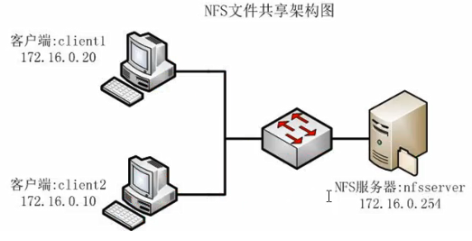
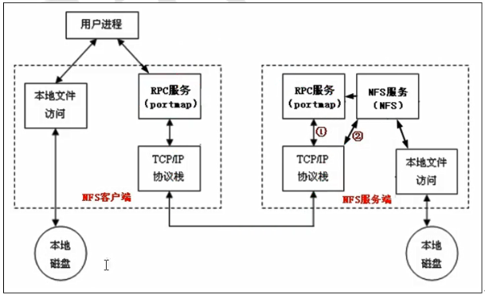

```text
https://www.bilibili.com/video/BV164411J761?p=66
```


### nfs client <=> nfs server


## nfs server
#### install
```shell script
[root@python-110 named]# yum install nfs-utils rpcbind
Dependencies Resolved

==================================================================================================================================
 Package                              Arch                      Version                             Repository               Size
==================================================================================================================================
Installing:
 nfs-utils                            x86_64                    1:1.3.0-0.68.el7                    base                    412 k
 rpcbind                              x86_64                    0.2.0-49.el7                        base                     60 k
Installing for dependencies:
 gssproxy                             x86_64                    0.7.0-29.el7                        base                    111 k
 keyutils                             x86_64                    1.5.8-3.el7                         base                     54 k
 libbasicobjects                      x86_64                    0.1.1-32.el7                        base                     26 k
 libcollection                        x86_64                    0.7.0-32.el7                        base                     42 k
 libevent                             x86_64                    2.0.21-4.el7                        base                    214 k
 libini_config                        x86_64                    1.3.1-32.el7                        base                     64 k
 libnfsidmap                          x86_64                    0.25-19.el7                         base                     50 k
 libpath_utils                        x86_64                    0.2.1-32.el7                        base                     28 k
 libref_array                         x86_64                    0.1.5-32.el7                        base                     27 k
 libverto-libevent                    x86_64                    0.2.5-4.el7                         base                    8.9 k
 quota                                x86_64                    1:4.01-19.el7                       base                    179 k
 quota-nls                            noarch                    1:4.01-19.el7                       base                     90 k
 tcp_wrappers                         x86_64                    7.6-77.el7                          base                     78 k

Transaction Summary
==================================================================================================================================
Install  2 Packages (+13 Dependent packages)

[root@python-110 /]# grep nfs /etc/passwd
rpcuser:x:29:29:RPC Service User:/var/lib/nfs:/sbin/nologin
nfsnobody:x:65534:65534:Anonymous NFS User:/var/lib/nfs:/sbin/nologin


```
#### configure
```shell script
[root@python-110 named]# ls -l /etc/| grep exports
-rw-r--r--.  1 root root        0 Jun  7  2013 exports
drwxr-xr-x   2 root root        6 Oct  1 01:10 exports.d

```

```shell script
[root@python-110 home]# mkdir zhangsan
[root@python-110 home]# ls -l
total 0
drwxrwxrwx 3 root sftp 19 Dec  7 13:09 sftp
drwxr-xr-x 2 root root  6 Dec  9 16:11 zhangsan
[root@python-110 home]# chmod o+w zhangsan/
[root@python-110 home]# ls -l
total 0
drwxr-xrwx 2 root root  6 Dec  9 16:11 zhangsan

```

```shell script
[root@python-110 home]# vi /etc/exports
/home/zhangsan 192.168.2.*(rw)

```

#### start rpcbind, nfs
```shell script
[root@python-110 home]# systemctl status rpcbind
● rpcbind.service - RPC bind service
   Loaded: loaded (/usr/lib/systemd/system/rpcbind.service; enabled; vendor preset: enabled)
   Active: inactive (dead)
[root@python-110 home]# systemctl start rpcbind
[root@python-110 home]# systemctl status rpcbind
● rpcbind.service - RPC bind service
   Loaded: loaded (/usr/lib/systemd/system/rpcbind.service; enabled; vendor preset: enabled)
   Active: active (running) since Wed 2020-12-09 16:16:40 CST; 2s ago
  Process: 4706 ExecStart=/sbin/rpcbind -w $RPCBIND_ARGS (code=exited, status=0/SUCCESS)
 Main PID: 4707 (rpcbind)
    Tasks: 1
   Memory: 724.0K
   CGroup: /system.slice/rpcbind.service
           └─4707 /sbin/rpcbind -w

Dec 09 16:16:40 python-110 systemd[1]: Starting RPC bind service...
Dec 09 16:16:40 python-110 systemd[1]: Started RPC bind service.

```

```shell script
[root@python-110 home]# systemctl status nfs
● nfs-server.service - NFS server and services
   Loaded: loaded (/usr/lib/systemd/system/nfs-server.service; disabled; vendor preset: disabled)
   Active: inactive (dead)
[root@python-110 home]# systemctl start nfs
[root@python-110 home]# systemctl status nfs
● nfs-server.service - NFS server and services
   Loaded: loaded (/usr/lib/systemd/system/nfs-server.service; disabled; vendor preset: disabled)
   Active: active (exited) since Wed 2020-12-09 16:18:00 CST; 2s ago
  Process: 4767 ExecStartPost=/bin/sh -c if systemctl -q is-active gssproxy; then systemctl reload gssproxy ; fi (code=exited, status=0/SUCCESS)
  Process: 4750 ExecStart=/usr/sbin/rpc.nfsd $RPCNFSDARGS (code=exited, status=0/SUCCESS)
  Process: 4749 ExecStartPre=/usr/sbin/exportfs -r (code=exited, status=1/FAILURE)
 Main PID: 4750 (code=exited, status=0/SUCCESS)
    Tasks: 0
   Memory: 0B
   CGroup: /system.slice/nfs-server.service

Dec 09 16:18:00 python-110 systemd[1]: Starting NFS server and services...
Dec 09 16:18:00 python-110 exportfs[4749]: exportfs: Failed to stat /etc/zhangsan: No such file or directory
Dec 09 16:18:00 python-110 systemd[1]: Started NFS server and services.
[root@python-110 zhangsan]# exportfs
/home/zhangsan	192.168.2.*

[root@python-110 zhangsan]# showmount -e 192.168.2.110
Export list for 192.168.2.110:
/home/zhangsan 192.168.2.*

[root@python-110 home]# netstat -lntp
Active Internet connections (only servers)
Proto Recv-Q Send-Q Local Address           Foreign Address         State       PID/Program name    
tcp        0      0 0.0.0.0:111             0.0.0.0:*               LISTEN      4707/rpcbind        
tcp        0      0 0.0.0.0:20048           0.0.0.0:*               LISTEN      4747/rpc.mountd     
tcp        0      0 0.0.0.0:35633           0.0.0.0:*               LISTEN      -                   
tcp        0      0 172.17.0.1:53           0.0.0.0:*               LISTEN      4450/named          
tcp        0      0 192.168.3.110:53        0.0.0.0:*               LISTEN      4450/named          
tcp        0      0 192.168.2.110:53        0.0.0.0:*               LISTEN      4450/named          
tcp        0      0 127.0.0.1:53            0.0.0.0:*               LISTEN      4450/named          
tcp        0      0 0.0.0.0:22              0.0.0.0:*               LISTEN      2443/sshd           
tcp        0      0 0.0.0.0:50423           0.0.0.0:*               LISTEN      4734/rpc.statd      
tcp        0      0 127.0.0.1:953           0.0.0.0:*               LISTEN      4450/named          
tcp        0      0 127.0.0.1:25            0.0.0.0:*               LISTEN      1280/master         
tcp        0      0 0.0.0.0:2049            0.0.0.0:*               LISTEN      -                   
tcp6       0      0 :::46505                :::*                    LISTEN      -                   
tcp6       0      0 :::111                  :::*                    LISTEN      4707/rpcbind        
tcp6       0      0 :::20048                :::*                    LISTEN      4747/rpc.mountd     
tcp6       0      0 :::53                   :::*                    LISTEN      4450/named          
tcp6       0      0 :::22                   :::*                    LISTEN      2443/sshd           
tcp6       0      0 ::1:953                 :::*                    LISTEN      4450/named          
tcp6       0      0 ::1:25                  :::*                    LISTEN      1280/master         
tcp6       0      0 :::2049                 :::*                    LISTEN      -                   
tcp6       0      0 :::49953                :::*                    LISTEN      4734/rpc.statd      

```
### Keng, stop firewall at nfs server
```shell script
[root@python-110 home]# systemctl stop firewalld

[root@test-2-3-21 ~]# showmount -e 192.168.2.110
clnt_create: RPC: Port mapper failure - Unable to receive: errno 113 (No route to host)
[root@test-2-3-21 zhangsan]# showmount -e 192.168.2.110
Export list for 192.168.2.110:
/home/zhangsan 192.168.2.*

```

## nfs client
```shell script
[root@docker-210 ~]# yum install nfs-utils
Dependencies Resolved

==================================================================================================================================
 Package                              Arch                      Version                             Repository               Size
==================================================================================================================================
Installing:
 nfs-utils                            x86_64                    1:1.3.0-0.68.el7                    base                    412 k
Installing for dependencies:
 gssproxy                             x86_64                    0.7.0-29.el7                        base                    111 k
 keyutils                             x86_64                    1.5.8-3.el7                         base                     54 k
 libbasicobjects                      x86_64                    0.1.1-32.el7                        base                     26 k
 libcollection                        x86_64                    0.7.0-32.el7                        base                     42 k
 libevent                             x86_64                    2.0.21-4.el7                        base                    214 k
 libini_config                        x86_64                    1.3.1-32.el7                        base                     64 k
 libnfsidmap                          x86_64                    0.25-19.el7                         base                     50 k
 libpath_utils                        x86_64                    0.2.1-32.el7                        base                     28 k
 libref_array                         x86_64                    0.1.5-32.el7                        base                     27 k
 libtirpc                             x86_64                    0.2.4-0.16.el7                      base                     89 k
 libverto-libevent                    x86_64                    0.2.5-4.el7                         base                    8.9 k
 quota                                x86_64                    1:4.01-19.el7                       base                    179 k
 quota-nls                            noarch                    1:4.01-19.el7                       base                     90 k
 rpcbind                              x86_64                    0.2.0-49.el7                        base                     60 k
 tcp_wrappers                         x86_64                    7.6-77.el7                          base                     78 k

Transaction Summary
==================================================================================================================================
Install  1 Package (+15 Dependent packages)

Total download size: 1.5 M


[root@docker-210 ~]# showmount -e 192.168.2.110
Export list for 192.168.2.110:
/home/zhangsan 192.168.2.0
[root@docker-210 ~]# netstat -lnpt
Active Internet connections (only servers)
Proto Recv-Q Send-Q Local Address           Foreign Address         State       PID/Program name    
tcp        0      0 0.0.0.0:22              0.0.0.0:*               LISTEN      1006/sshd           
tcp        0      0 127.0.0.1:25            0.0.0.0:*               LISTEN      1148/master         
tcp6       0      0 :::22                   :::*                    LISTEN      1006/sshd           
tcp6       0      0 ::1:25                  :::*                    LISTEN      1148/master  
```

```shell script
[root@docker-210 home]# mkdir zhangsan

[root@test-2-3-21 media]# mount -o vers=3 192.168.2.110:/home/zhangsan /media/zhangsan/
[root@test-2-3-21 media]# cd zhangsan/
[root@test-2-3-21 zhangsan]# ls
ww.s

[root@docker-210 home]# umount -v /home/zhangsan/
/home/zhangsan: nfs mount point detected
/home/zhangsan: umounted

```
### keng
```shell script
[root@test-2-3-21 html]# umount /var/www/html/
umount.nfs: /var/www/html: device is busy

[root@docker-210 var]# yum install pcmisc
[root@test-2-3-21 html]# fuser -m -v /var/www/html/
                     USER        PID ACCESS COMMAND
/var/www/html:       root     kernel mount /media/zhangsan
                     root       2662 ..c.. bash
[root@test-2-3-21 html]# kill -9 2662
Connection closing...Socket close.

Connection closed by foreign host.

Disconnected from remote host(192.168.2.21) at 17:58:57.

Type `help' to learn how to use Xshell prompt.


[root@test-2-3-21 html]# mount -l | grep 192
192.168.2.110:/home/zhangsan on /media/zhangsan type nfs (rw,relatime,vers=3,rsize=262144,wsize=262144,namlen=255,hard,proto=tcp,timeo=600,retrans=2,sec=sys,mountaddr=192.168.2.110,mountvers=3,mountport=20048,mountproto=udp,local_lock=none,addr=192.168.2.110)
[root@test-2-3-21 html]# umount -f /media/zhangsan/

```
## Keng, apache, nfs
#### trouble
```shell script
[root@docker-30 ~]# curl www.gwaysoft.com
<!DOCTYPE html PUBLIC "-//W3C//DTD XHTML 1.1//EN" "http://www.w3.org/TR/xhtml11/DTD/xhtml11.dtd"><html><head>
<meta http-equiv="content-type" content="text/html; charset=UTF-8">
		<title>Apache HTTP Server Test Page powered by CentOS</title>

#or
[root@docker-210 html]# curl www.gwaysoft.com/ct.html
<!DOCTYPE HTML PUBLIC "-//IETF//DTD HTML 2.0//EN">
<html><head>
<title>403 Forbidden</title>
</head><body>
<h1>Forbidden</h1>
<p>You don't have permission to access /ct.html
on this server.</p>
</body></html>
```
#### shooting
```shell script
# set SeLinux on httpd's server
[root@test-2-3-21 html]# getenforce
Enforcing
[root@test-2-3-21 html]# setenforce 0
[root@test-2-3-21 html]# getenforce
Permissive
```
