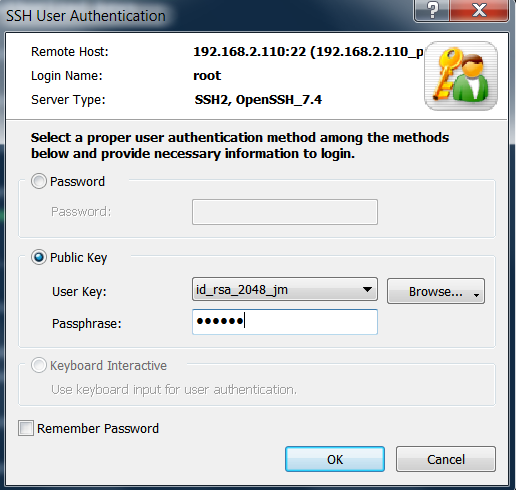

## centos7 (root) or windows7 (david.wei) A -> centos7 (root) B
```text
https://www.bilibili.com/video/BV164411J761?p=14
```
### A generate key
    # usage: ssh-keygen [-q] [-b bits] [-t dsa | ecdsa | ed25519 | rsa | rsa1]
    # ssh-keygen -t rsa -b 2048
    [root@localhost ~]# ssh-keygen -t rsa
    Generating public/private rsa key pair.
    
#### A check
    [root@localhost .ssh]# pwd
    /root/.ssh
    [root@localhost .ssh]# ls
    id_rsa  id_rsa.pub

### A copy ~/.ssh/id_rsa.pub(A) to ~/.ssh/authorized_keys(B) 
```shell script
# Usage: /usr/bin/ssh-copy-id [-h|-?|-f|-n] [-i [identity_file]] [-p port] [[-o <ssh -o options>] ...] [user@]hostname
# ssh-copy-id root@192.168.2.210 -i id_rsa.pub -p 22
[root@python-110 ~]# ssh-copy-id root@192.168.2.210
/usr/bin/ssh-copy-id: INFO: Source of key(s) to be installed: "/root/.ssh/id_rsa.pub"
The authenticity of host '192.168.2.210 (192.168.2.210)' can't be established.
ECDSA key fingerprint is SHA256:1dQbJB8uctuonpJsqJue6HHk6gfRcNyEv5CIvNoLtAM.
ECDSA key fingerprint is MD5:18:dc:80:82:8b:86:3c:ff:0d:ed:3a:71:28:b3:5b:e2.
Are you sure you want to continue connecting (yes/no)? yes
/usr/bin/ssh-copy-id: INFO: attempting to log in with the new key(s), to filter out any that are already installed
/usr/bin/ssh-copy-id: INFO: 1 key(s) remain to be installed -- if you are prompted now it is to install the new keys
root@192.168.2.210's password: 

Number of key(s) added: 1

Now try logging into the machine, with:   "ssh 'root@192.168.2.210'"
and check to make sure that only the key(s) you wanted were added.

[root@python-110 ~]# ssh root@192.168.2.210
Last login: Thu Nov 26 10:36:44 2020 from 192.168.2.15
```

## Xshell
```text
1. Tools -> User Key Management -> generate
2. add public key to ~/.ssh/authorized_key
3. Session Manager right button-> Properties -> Connection -> Authentication
```


## sshd_config settings
### deny password login
```shell script
[root@python-110 ssh]# ls -l /etc/ssh 
total 604
-rw-r--r--. 1 root root       2276 Aug  9  2019 ssh_config    # ssh client config
-rw-------. 1 root root       3929 Nov  4 10:53 sshd_config   # ssh server config

[root@python-110 ssh]# vi sshd_config 
     63 # To disable tunneled clear text passwords, change to no here!
     64 #PasswordAuthentication yes
     65 #PermitEmptyPasswords no
     66 PasswordAuthentication no   # yes -> no

# must reboot
[root@python-110 ssh]# systemctl restart sshd
```
### deny root to login
```shell script
[root@python-110 ssh]# vi sshd_config
     38 #PermitRootLogin yes # -> no

[root@docker-210 ~]# systemctl restart sshd
[root@docker-210 ~]# useradd lisi
[root@docker-210 ~]# passwd lisi
Changing password for user lisi.
New password: 
BAD PASSWORD: The password is shorter than 8 characters
Retype new password: 
passwd: all authentication tokens updated successfully.
[root@docker-210 ~]# logout

# lisi | lisi
Last login: Thu Nov 26 14:50:18 2020
[lisi@docker-210 ~]$ pwd
/home/lisi

[lisi@docker-210 ~]$ su
Password: 
[root@docker-210 lisi]# 
```

### port
```shell script
[root@python-110 ssh]# vi sshd_config
     17 #Port 22

# ssh -p 5000 root@192.168.2.110
```
### restrict listen address
#### add sub sub ethernet ens33
```shell script
[root@docker-210 ~]# ifconfig ens33:0 192.168.2.221
[root@docker-210 ~]# ifconfig
ens33: flags=4163<UP,BROADCAST,RUNNING,MULTICAST>  mtu 1500
        inet 192.168.2.210  netmask 255.255.255.0  broadcast 192.168.2.255
        inet6 fe80::20c:29ff:fe44:72a0  prefixlen 64  scopeid 0x20<link>
        ether 00:0c:29:44:72:a0  txqueuelen 1000  (Ethernet)
        RX packets 62181  bytes 24433844 (23.3 MiB)
        RX errors 0  dropped 0  overruns 0  frame 0
        TX packets 30462  bytes 2493126 (2.3 MiB)
        TX errors 0  dropped 0 overruns 0  carrier 0  collisions 0

ens33:0: flags=4163<UP,BROADCAST,RUNNING,MULTICAST>  mtu 1500
        inet 192.168.2.221  netmask 255.255.255.0  broadcast 192.168.2.255
        ether 00:0c:29:44:72:a0  txqueuelen 1000  (Ethernet)
```
#### vi listen address from 192.168.2.220 to 192.168.2.221
```shell script
[root@docker-210 ~]# vi /etc/ssh/sshd_config 
     19 ListenAddress 192.168.2.221
     20 #ListenAddress ::
[root@docker-210 ~]# systemctl restart sshd
[root@docker-210 ~]# exit
logout
Connection to 192.168.2.221 closed.
[root@python-110 ~]# ssh root@192.168.2.220
ssh: connect to host 192.168.2.220 port 22: No route to host
[root@python-110 ~]# ssh root@192.168.2.221
Last login: Thu Nov 26 15:10:25 2020 from 192.168.2.110
[root@docker-210 ~]# 
```
