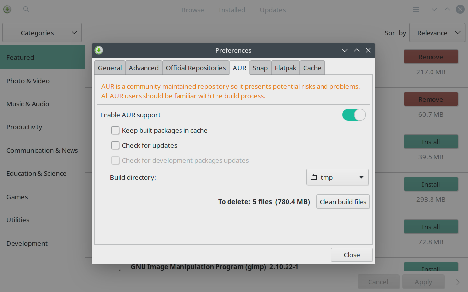

### install

```text
https://unix.stackexchange.com/questions/546595/issue-with-pacman-error-failed-to-prepare-transaction
$ sudo pacman -Syu
```


```shell
[david@david-portegem800 ~]$ sudo pacman -Sy vim                     
:: Synchronizing package databases...
error: failed to update core (unable to lock database)
error: failed to update extra (unable to lock database)
error: failed to update community (unable to lock database)
error: failed to update multilib (unable to lock database)
error: failed to synchronize all databases

[david@david-portegem800 ~]$ sudo pacman -Sy vim              
:: Synchronizing package databases...
 core is up to date
 extra is up to date
 community is up to date
 multilib is up to date

```


```text
sudo pacman -S --noconfirm fcitx-im kcm-fcitx fcitx-sunpinyin
sudo echo -e "export GTK_IM_MODULE=fcitx\nexport QT_IM_MODULE=fcitx\nexport XMODIFIERS=@im=fcitx">>~/.bash_profile

[david@david-portegem800 ~]$ cat .bash_profile 
#
# ~/.bash_profile
#
[[ -f ~/.bashrc ]] && . ~/.bashrc
export GTK_IM_MODULE=fcitx
export QT_IM_MODULE=fcitx
export XMODIFIERS=@im=fcitx

```